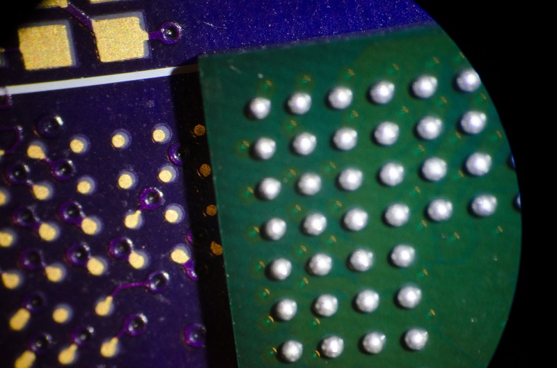
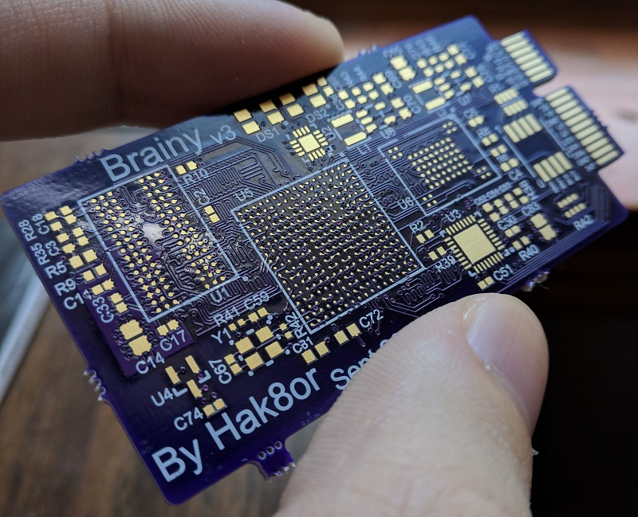
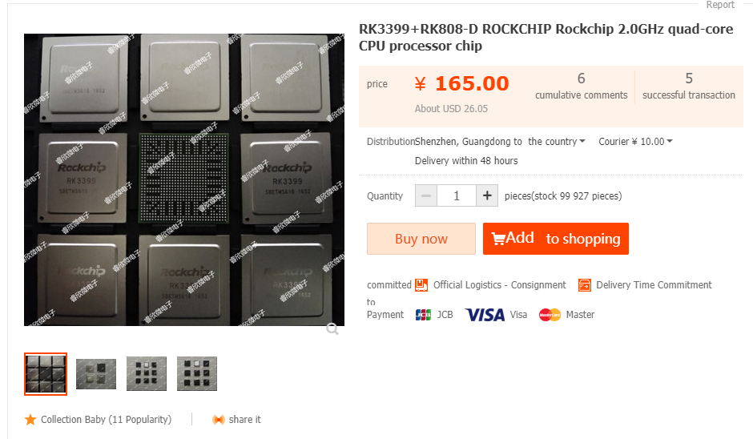

# Final Thoughts

The goal was to make an embedded Linux system from scratch. Originally it was planned to use the NAND Flash IC (```S34ML04G200TFI000``` at 512 MB) on the board, but sadly it doesn't work for some reason. Likely due to BGA soldering issues. Since that didn't work Dataflash was used instead, in which case it made this project more interesting on the software side due to having a size requirement.

For storage, the root file system had to fit in under ```2.217 MB```, which when including all the packages above (except HTTP servers), we fit at ```2.148 MB```. So, in under 4 MB of flash we were able to fit in the kernel including drivers for our WiFi dongle, and a root file system with tons of networking things built in. A big reason why we were able to do this though is because the file system is both read only and using intense compression. When booting the system you can tell it takes a bit of time for the boot to finish at one point (~2 second hiccup). This is due to the slow 400 Mhz ARM926EJ based core having to load the root file system over a 33 Mhz SPI bus from Data Flash and then extract it.

If you noticed, there are mentions of Brainy**V2** sprinkled around. As you can guess, this is the second version of my "Brainy" series of projects. The first one was my first every 4 layer PCB and first foray into BGA IC's and signals faster than those present in a 120 Mhz ARM MCU.



It was a total disaster in terms of assembly (footprint for the BGA IC was way too small) and expensive to reproduce (~$20 worth of components for a ~25 PCB and many hours of assembly). Modularity was king at this point, so if a design has to be redone it only needs the most likely part to fail (main logic board with SOC + DRAM) to be discarded, saving money and time.

OSH Park (the fab I use) can at best do 4 layer PCB's with BGA pitch of 0.8 MM due to the trace width and space being at minimum 5 mil. If the BGA pitch is less than 0.8 MM then you cannot put traces between the pads on the PCB, and therefore being unable to fanout traces more than 1 layer deep. Thankfully there are still many BGA IC's out there that have a ball pitch of 0.8 mm.

All in all, this was a great project. This totally satisfied my need of making a Linux system from scratch and learning lots on the way. My one gripe is how much of a pain it is to assemble these chips, it's easily half a day of work to put one board together, and the likely hood of failure during assembly is high.

## Brainy V3 and onwards

Even though assembly of these boards is a pain, and I am not willing to pay a few hundred to outsource assembly on a potentially bad design, I want to make more. Brainy V3 is composed of two designs, each using a more modern SOC, one from Allwinner (V3s) and the other from Freescale (SoloLite). The V3s design has an SDIO based WiFi solution embedded into the PCB too! The PCB design is complete but has to be fixed (pads for BGA were too small again, silk is bad in areas, etc) before assembly and testing is done.




For Brainy V4, I will likely use a PCB fab which can handle BGA ball pitches of 0.65 MM, which gives me access to much more modern SOC's like the [RK3399](http://opensource.rock-chips.com/wiki_RK3399). This beast has two 64 bit A72 cores running at 1.8 Ghz and 4 A53 cores running at 1.4 Ghz, Display Port, HDMI, 2x 4 Lane MIPI DSI, PCI-E 4x Lane, and can handle a 64 bit memory interface to LPDDR4 RAM. It's accessible via Taobao and it's documentation is online, including various designs which can be used as reference.


