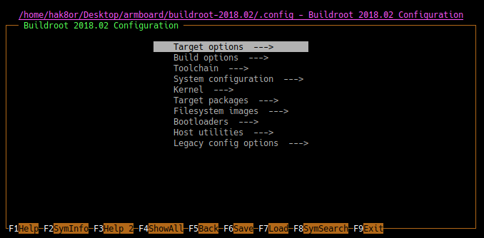

# Buildroot

## The heck is Buildroot?



The [Old School](OldSchool/readme.md) guide shows how to set the kernel and root file system up by hand which, while a great learning experience, is extremely tedious and error prone. A few years ago amongst an enormous mass of custom shell and python scripts in an attempt to automate this process, the community decided to make [BuildRoot](https://buildroot.org/). This automates all of the following for you;

- Downloading and compiling a toolchain
- Downloading and cross compiling the kernel, Busybox, packages for rootFS
- Dependency management for packages
- Wrappers for menuconfig of Busybox, Linux, and more
- Optionally can handle AT91 Bootstrap and U-Boot
- Creates a root file system (and even compresses it)
- Wrapped up in makefiles which support ```nconfig``` and ```xconfig```

In short, Busybox is an amazing tool that takes all the pain out of setting up a Linux based system. What about [Yocto](https://www.yoctoproject.org/)? I didn't get a chance to actually try it out yet, so Buildroot it is!

Going back to our original goal, we want a minimal system that can fit in under 4 Megabytes. This means no xorg (no graphical interface), no package manager, no Python or Ruby, only the basic necessities. Conceptually we need three different items, the Linux Kernel, the Root File System (ROOTFS, contains Busybox and our applications), and the Device Tree. Since the root file system will remain on the SPI based device flash, the kernel needs the driver for the SPI peripheral on our SOC.

To get Buildroot, you can use the [site](https://buildroot.org/download.html) and extract the archive.

```bash
# Download the package
wget https://buildroot.org/downloads/buildroot-2018.02.tar.gz

# Extract Ze Full archive (tar -xzf)
tar -xzf buildroot-2018.02.tar.gz
```

## Defconfig

Buildroot also makes use of [defconfig's](https://stackoverflow.com/questions/41885015/what-exactly-does-linux-kernels-make-defconfig-do) (default configurations), which you can find by just doing a simple ```find```.

```bash
[hak8or@hak8or buildroot-2018.02]$ find . -name "*defconfig" | grep "at91"
./output/build/linux-headers-4.13/arch/arm/configs/at91_dt_defconfig
./output/build/linux-4.13/arch/arm/configs/at91_dt_defconfig
./configs/at91sam9x5ek_mmc_dev_defconfig
./configs/at91sam9260eknf_defconfig
        ...
```

Sadly there is no defconfig for our specific board. Usually it's sufficient to just find and adapt the closest defconfig and use that instead, specifically using the same CPU core (```AT91SAM9N12``` uses an ```ARM926EJ-S``` ), but let's try to do this ourselves to see what a defconfig could include. Afterwards, the current configuration of buildroot can be saved as a defconfig which will allow to use a simple ```make AT91SAM9N12_OurCustomBoard_defconfig``` to automatically select everything mentioned below.

## Our Tiny Defconfig

As said earlier, this SOC uses an ```ARM926EJ-S``` based core running at 400 Mhz with 64 MB of DDR2 SDRAM. When running ```make nconfig``` at the root of the Buildroot directory, go to ```Target Options ---> Target Architecture``` and select ```ARM Little Endian```. To set the actual CPU core, go to ```Target Options ---> Target Architecture Variant``` and select ```arm926t``` (yes, we actually have the "EJ-S" variant but this works fine).

We want the Linux kernel of course, so in the ```Kernel --->``` tab enable the kernel which should populate the kernel version field with ```4.15``` (as of Q1 2018). The linux kernel itself does have a default config for our SOC so select ```in-tree defconfig file``` and type ```at91_dt``` in the "Defconfig Name" field. This configuration has the kernel include various drivers for Atmel's AT91SAM series of IC's and assumes a device tree will be appended to the kernel image.

For the ```Toolchain --->``` tab, select both ```Enable C++ support``` and ```Enable WCHAR support``` because we will need that later for many applications. I would suggest also selecting to use the latest ```binutils``` and ```GCC```.

Next up is the device tree we made [earlier](devicetree.md). Create a file called ```at91sam9n12ek_custom.dts``` in the Linux kernel source folder (in my case being ```output/build/linux-4.15.7/arch/arm/boot/dts/```) containing that device tree. In the Kernel tab, enable ```Build a Device Tree Blob```, select ```Use a device tree present in the kernel``` and for the file name put ```at91sam9n12ek_custom``` (yes, there is no file extension included even though it says file name). This will have the kernel build process create a file in the ```output/images``` folder for the compiled device tree with the ```.dtb``` file extension instead of us having to do this manually.

Lastly, we only have 4 MB for everything so compression is extremely important. For the root file system we do not need it to be writable, so we can use [SquashFS](https://elinux.org/Squash_FS_Howto). This file system was designed specifically for space constrained systems and has tons of awesome features but has one large issue, it's read only. Also, the [xz](https://tukaani.org/xz/format.html) compression format seems to do the best on my system in terms of compression ratio. To enable the root file system to use squashfs with xz, go to ```Filesystem images --->``` and select ```squashfs root filesystem``` with ```Compression algorithm (xz)```. For the kernel, go to ```Kernel --->``` and ensure the ```Kernel binary format``` is a ```zImage``` with the compression set to ```zx compression```.

To summarize, here is what you need to change:

```none
Buildroot nconfig
    Target Options
        Target Architecture = ARM Little Nedian
        Target Architecture Variant = arm926t
    Kernel
        Enabled
        Kernel Configuration = in-tree defconfig file
        Defconfig name = at91_dt
        Kernel compression format = xz compression
        Build a Device Tree Blob = Checked
            Use a device tree present in the kernel
            Device Tree Source file names = at91sam9n12ek_custom
    Filesystem images
        tar the root filesystem = unchecked
        squashfs = checked
            Compression algorithm = xz
    Toolchain
        Enable WCHAR support = checked
        Binutils Version = 2.3
        GCC compiler Version = 7.x
        Enable C++ support = checked
```

Run ```make``` and wait a while. This will download and compile for GCC (our cross compiler), the Linux kernel, Busybox, tools for the host, create a root file system, and lastly create images for both the Kernel and the root file system. This will take a pretty long time (half an hour on an I5-3570k OC'd to 4.6 Ghz running from an SSD and 4.5 GB RAM), so go grab an espresso in the meantime.

## Size Restrictions

At this point you should have a kernel and root file system that is only ```3.9 Megabytes``` large.

```bash
[hak8or@hak8or buildroot-2018.02]$ ls -lh output/images/
total 3.9M
-rw-r--r-- 1 hak8or users  18K Apr  2 17:34 at91sam9n12ek_custom.dtb
-rw-r--r-- 1 hak8or users 1.2M Apr  2 17:34 rootfs.squashfs
-rw-r--r-- 1 hak8or users 2.7M Apr  2 17:34 zImage
```

This has everything we need to boot, but remember that we only have 4 MB to play with. Given our earlier size constraints for the root file system (```2.217 MB```) and kernel (```1.846 MB```), the kernel (```2.7M```) won't fit. [Next](smaller.md) up is looking into what we can remove in order to decrease in size.
