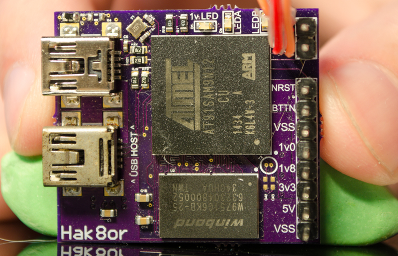

# Atmel SAM9N12 Embedded Linux System



## Description

The SAM9N12 is a low cost MPU from Atmel (now Microchip) that is capable of running linux. It's based on a 400 MHz ARM926EJ-S core from ARM (very old, a far cry from what you can get in even the cheapest of phones or tablets) and has a 32 bit EBI (External Bus Interface) to work with both SDRAM and NAND Flash at the same time. It can also use SPI based FLASH and USB OTG letting you use a USB Flash drive as another data store.

This board has:

* 64 MB of DDR2-SDRAM (W9751G6KB-25-ND)
* 4 MB of Dataflash (AT45DB321E-SHF-B)
* USB OTG and USB Device broken out (both only up to 12 Mbps Full Speed)

Originally this project was done years ago relying on Atmel forked branches of U-Boot and the Linux kernel from Atmel. While this did work, it meant having to use old non mainlined versions of each project. Later this project was restarted with the intention of using mainline sources for everything and BuildRoot to streamline the linux and root filesystem generation. The old version of this documentation, dubbed "Old School", can be found [here](OldSchool.md), and shows how to do everything **manually**. This includes compiling the Linux kernel by hand to generate a zImage, creating a minimal root file system, and even using flash drive for the root file system including a native GCC toolchain!

This documentation will show the process of bringing a board like this up from start to finish, including describing the intended boot flow, how to configure all the software (AT91 Bootstrap, Kernel, root file system, BuildRoot, etc), show various bugs and issues found in the process (USB OTG was a fun one), how much space various functionality uses, and how to build a semi useful root file system (networking, stress, htop, tmux, etc).

The end goal is to have a system that can do the following:

- Boot to a shell and be able to communicate with it over serial
- Networking support
- Use the [RNX-N150HG](https://wikidevi.com/wiki/Rosewill_RNX-N150HG) USB WiFi dongle to talk to the outside world
- Read only file system with compression (SquashFS)
- Run various tools (htop, stress, tmux, ping)
- If possible, an ssh server and [TCC](https://www.wikiwand.com/en/Tiny_C_Compiler) to compile a small C based demo program

## Status

Everything seems to work except NAND flash, likely due to soldering issues with the SAM9N12 BGA based package. Because NAND flash isn't working, it was decided to try and stick everything in the 32 Megabit Data flash (yep, only 4 Megabytes for a boot loader, kernel, and root file system). USB OTG is used for a Wifi dongle so we get networking support to make this more interesting.

## Boot Flow

The AT91SAM9N12 has a boot loader in ROM which can boot from NAND Flash, SPI Flash, SPI Data flash, and can even boot directly into the Linux kernel (therefore not needing U-Boot). There has been some reverse engineering work done on the boot loader [here](http://hobbygenius.co.uk/blog/1622).

The memory setup we will be using is as follows:

    AT45DB321E-SHF-B    32 Mbit ->   4,325,376 Byte or 0x__42_0000 (8192 Pages * 528 Bytes)
    W9751G6KB-25-ND    512 MBit ->  67,108,864 Byte or 0x_400_0000

            Flash                                  Item                   DRAM
    0x000000 <MAX: 0x0026D8>                   AT91 bootstrap    ->    Not Copied
    0x002800 <MAX: 0x004B00>                   Device Tree       ->    0x2100_0000
    0x007300 <MAX: 0x1D8D00 or 1,936,640B>     zImage            ->    0x2200_0000
    0x1E0000 <MAX: 0x237C00 or 2,325,504B>     RootFS            ->    Not Copied
    0x417C00 <MAX: 0x008400>                   Non Volatile      ->    Not Copied/Used

As a rough overview to show in the grand scheme of things how this will look:

1. The boot loader will first look for any boot-able data in SPI Flash, SPI Data flash, and NAND Flash. In our case, we have the AT91 BootStrap in Dataflash at an offset of zero (start of Data flash).
2. The [AT91 Bootstrap](http://www.at91.com/linux4sam/bin/view/Linux4SAM/AT91Bootstrap) will initialize DRAM and then copy data from Data flash (in our case the Kernel at an offset of ```0x7300```) into DRAM (at ```0x2200_0000```), and the Device Tree from Dataflash at an offset of ```0x4B00``` to DRAM at ```0x2100_0000```. 
3. Then the boot loader will initialize the environment for the Linux kernel (address of device tree in a register, etc) and pass execution to the kernel.
4. Since the kernel is a zImage (self extracting kernel image), the kernel will uncompress itself, execute itself, read the device tree which was copied to RAM earlier, initialize various drivers based on the device tree entries, and lastly pass execution to whatever is relevant in the root file system.

## First boot

First things first, let's get the board powered up with the Dataflash erased. Upon bootup the boot loader in ROM of the SAM9N12 will configure basic clocking and the ```DBGU``` serial port on pins ```R5``` and ```R6``` to run at 115200 baud and output the text ```RomBOOT```. If you see this then it means a lot went right, such as power integrity, clocking, BGA packages soldered correctly, and of course no magic smoke means no shorts. [Next](SAMBA.md) we will look into getting setting up SAMBA so we can flash the AT91 Bootstrap to data flash.
