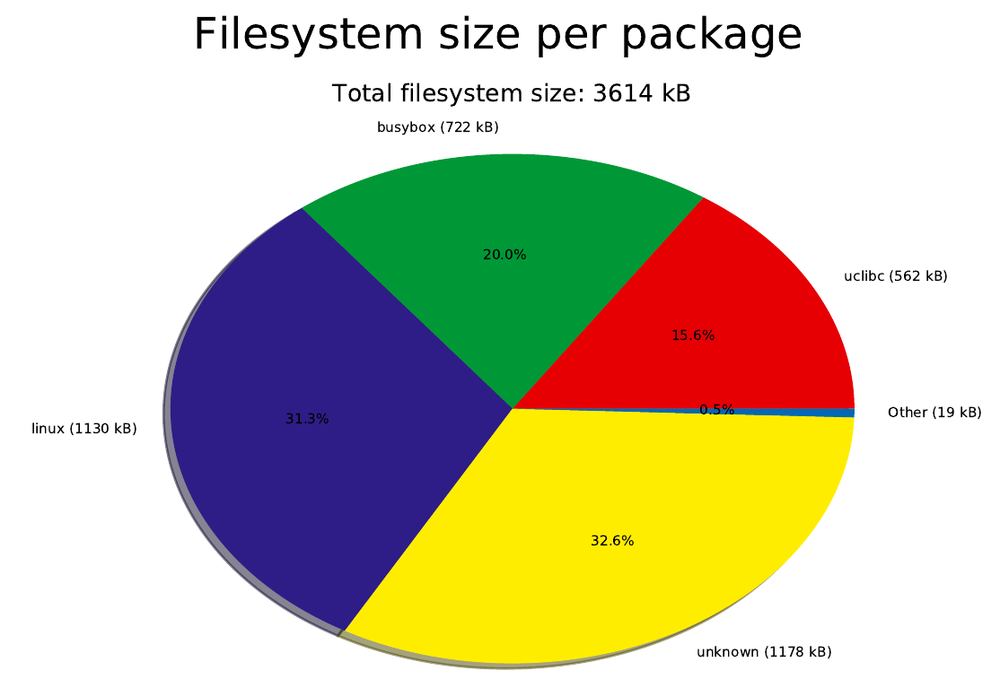
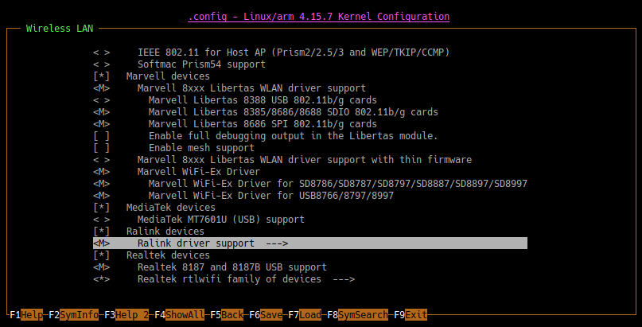

# Making things smaller

## Measuring

As shown earlier, we have a ```2.7 MB``` zImage (kerenel image) when our size limit is ```1.846 MB```, and our root file system is ```1.2 MB``` which is under the max of ```2.217 MB```. There are two points of confusion here:

- Why is the root file system so large? It should only have busybox with ```libc``` and ```libc++``` which when combined shouldn't be over a megabyte.
- What can we remove from the zImage to get the kernel size down while still have a decently functional system?

Lets look at the root file system first since Buildroot provides ```make graph-size```. This will let us see what is occupying so much space in our rootfs via nice plots and csv files in the ```output/graphs``` folder. Keep in mind that "Total filesystem size" is the uncompressed version, meaning no compression has been applied. After pumping the root filesystem through squashfs and then compressing it with xz it drops from ```3.5 MB``` down to ```1.2 MB```. 



Hm, that is unusual, what the heck is "Linux"? The kernel isn't in the root file system (it's put in a totally separate area in data flash). Unknown is also worth looking into. Thankfully Buildroot also generates a file called ```file-size-stats.csv```. The contents help give us more information, of which a trimmed version is below.

```none
[hak8or@hak8or graphs]$ cat file-size-stats.csv | awk '{gsub("lib/modules/4.15.7/kernel/drivers/", "..."); print}' | column -s, -t | grep -v " 4096 " | sort -n -k 3 | tail -n 10
File name                                                    Package name          File size  Package size  File size in package (%)  File size in system (%)
...net/wireless/realtek/rtlwifi/rtl8192c/rtl8192c-common.ko  linux                 48268      1130774       4.3                       1.3
...net/wireless/ralink/rt2x00/rt2x00lib.ko                   linux                 48736      1130774       4.3                       1.3
...net/wireless/ralink/rt2x00/rt2800usb.ko                   linux                 49804      1130774       4.4                       1.4
...net/wireless/marvell/libertas/libertas.ko                 linux                 65316      1130774       5.8                       1.8
...net/wireless/realtek/rtlwifi/rtlwifi.ko                   linux                 75804      1130774       6.7                       2.1
...net/wireless/realtek/rtlwifi/rtl8192cu/rtl8192cu.ko       linux                 82528      1130774       7.3                       2.3
...net/wireless/ralink/rt2x00/rt2800lib.ko                   linux                 96488      1130774       8.5                       2.7
...net/wireless/marvell/mwifiex/mwifiex.ko                   linux                 275384     1130774       24.4                      7.6
lib/libuClibc-1.0.28.so                                      uclibc                489384     562728        87.0                      13.5
bin/busybox                                                  busybox               719316     722918        99.5                      19.9
```

This tells us that a decent portion of the files seem to be device drivers for various USB based wireless dongles, and they all come from the linux package.

## Kernel

The Linux kernel is a monolithic kernel, meaning the entire Operating System is running in kernel space, including various device drivers. Therefore, device drivers tend to be included in the kernel source code, in our case being the USB wireless dongles, hence these drivers being marked as coming from the "Linux" package. When compiling the Linux kernel you can specify if you want various components to be compiled into the image (zImage in our case) or as "Modules" which get loaded at run time from the root file system. For example, in the below image of the kernel configuration, the "Marvel WiFi-Ex" drivers are compiled as modules while the "Realtek rtlwifi" drivers are compiled into the kernel image. This is why you see the Marvel drivers in the above snippet, since they are in the root file system instead of the kernel image. 



Buildroot lets you access various packages (one of which is Linux) through the make tool in the format of ```make *packagename*-make/menuconfig/nconfig/clean/rebuild```. For example, to view the menuconfig of the Linux kernel using nconfig, then you should use ```make linux-nconfig```. Looking around in there, we can see there are many options which are enabled, such as networking, 

