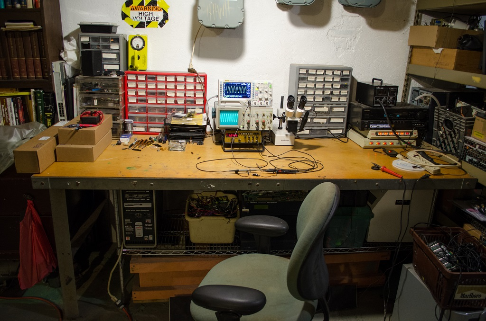

# Embedded Linux System

## Description and why

I like to dabble in embedded systems, this is my bread and butter. During college I was able to take an "Independent Study" course, which lets you do any project you want in replacement of a normal class. Since I did projects on my own anyways, this was awesome. At the time I really wanted to do a Linux capable board but at the time found most information on this to be targeting people whom are already experienced in this, or in other words, very little material for someone just getting started.

This projects therefore served three purposes; first to make a Linux capable board because that's just too awesome, secondly to create a guide (and reference for myself) for someone who was exactly in my situation in terms of knowledge, and thirdly to get those three credits. This was done using hardware available to me as a hobbyist (Broadcom scoffs at emails asking for pricing in small volume from mere mortals like myself) in 2015, and limitations of OSH Park's 4 layer service to make PCB's.

Please note, this writeup is **still in progress**! Typos and wierd grammar galore.

## Structure
This is divided into two designs, [one design](AT91SAM9N12/readme.md) being Atmel's AT91SAM9N12 which is the currently working board, and [the other](MX233/readme.md) being Freescale's I.MX223. Each project directory contains schematics, board files, potentially necessary patches, and various helper scripts.

Also, here are some [pictures](https://goo.gl/photos/XjbDx4G7ZKULxgLcA) of the designs in progress.

## Thanks Henrik!
For those who don't know, Henrik made [a board](http://hforsten.com/making-embedded-linux-computer.html) based on Atmel's SAM9N12 SoC (which I heavily used as a reference) roughly a year ago. This is what showed me as well as likely hundreds of others that such a thing is possible to do at home without thousands of dollars in equipment. His fantastic walkthrough is what inspired for me and guided me through nights of confusion and bewilderment, and if it weren't for him and his walkthrough this would have not been possible. So, Henrik, thank you!

## Propagation
- [Reddit](https://www.reddit.com/r/electronics/comments/3184up/inspired_by_henriks_embedded_linux_system_i_made/)
- [Hackaday](http://hackaday.com/2015/04/10/building-super-small-linux-computers-from-scratch/)
- [Dangerous Prototypes](http://dangerousprototypes.com/2015/04/07/embedded-linux-system/)
- [ARM](http://community.arm.com/groups/embedded/blog/2015/04/16/maker-builds-a-diy-embedded-linux-computer)
- [Elektroda.pl](http://www.elektroda.pl/rtvforum/topic3019687.html)
